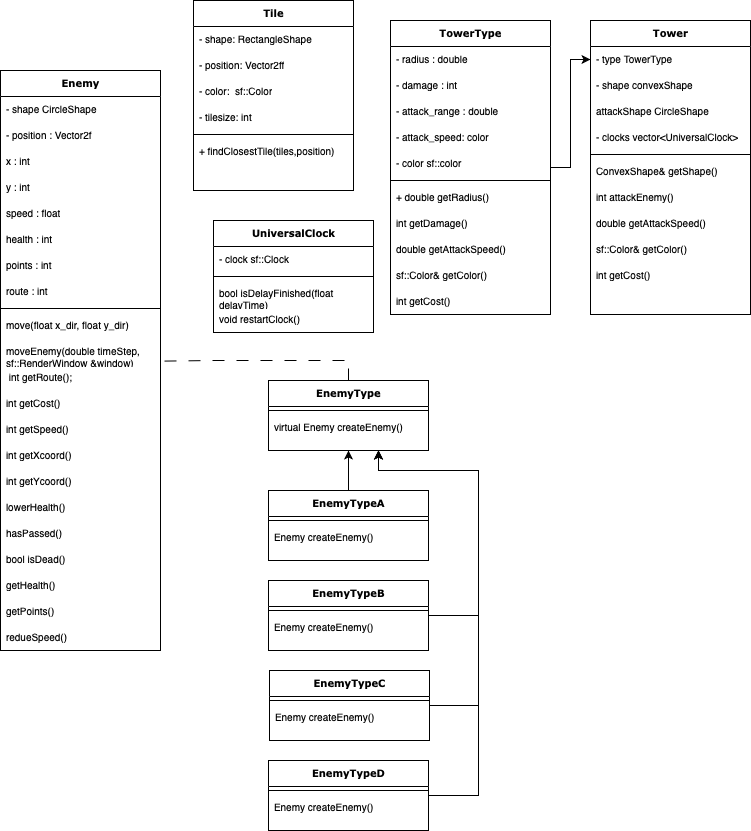

ELEC-7151 Object oriented programming software project fall 2023 

Akseli Tuominen, Nandu Jagdish, Niilo Siren, Noel Nironen 

 

Table of Contents 

  

1. Overview 

    	1.1 What the Software Does 

2. Software Structure 

    2.1 Overall Architecture 

    2.2 Class Relationships Diagrams 

    2.3 Interfaces to External Libraries 

3. Instructions for Building and Using the Software 

    3.1 Compilation Instructions 

        3.1.1 External Library Requirements 

        3.1.2 Running the software 

    3.2 Software Usage Guide 

4. Testing 

    4.1 Module Testing 

    4.2 Testing Methods 

    4.3 Testing Outcomes 

5. Work Log 

    5.1 Division of Work and Responsibilities 

    5.2 Weekly Work Descriptions 

 

Overview 

1.1 What the software does 

In our program we successfully implemented all the basic features mentioned in the project topic description: 

- A functioning tower defense game with basic graphics: 

- Enemies follow a single, non-branched path 

- Towers can shoot enemies inside their range 

- Game is lost if any enemy reaches the end of the path 

- Some money system, which gives more money per enemy killed and money is required to build towers 

- Two modes: placing towers, running a wave of enemies through the path (towers cannot be moved when enemies are on the map) 

- At least three different types of towers 

    - A basic tower that shoots enemies within its range 

    - A tower that slows down enemies within its range 

    - A tower that has extra-long range  

- At least three different types of enemies 

    - A basic enemy 

    - A tank enemy that has high health points, moves slow, and is immune to the tower slowing it down 

    - An enemy that moves extra quickly 

- At least five different levels with increasing difficulty 

- Controlling the game by mouse: user can build/remove towers either between waves of enemies or without restrictions. 

- Simple user interface that shows information such as resources, number of waves/enemies etc. 

 

In addition to these basic features, we added the following additional features: 

- Multiple enemy paths 

- Our path has an intersection where the enemies choose the path randomly 

- Additional tower that increases money 

- Additional enemy type that can attack towers 

- The map is read from a txt-file 

 

 

 

Instructions for building and using the software 

3.1.1 External Library Requirements 

Needed Libraries for Linux (most computers have them all). Mac and Windows also have them 

freetype 

x11 

xrandr 

udev 

opengl 

flac 

ogg 

vorbis 

vorbisenc 

vorbisfile 

openal 

pthread 

 

Downloading the libraries: 

sudo apt update 

sudo apt install \ 

    libxrandr-dev \ 

    libxcursor-dev \ 

    libudev-dev \ 

    libopenal-dev \ 

    libflac-dev \ 

    libvorbis-dev \ 

    libgl1-mesa-dev \ 

    libegl1-mesa-dev \ 

    libdrm-dev \ 

    libgbm-dev \ 

    libfreetype-dev 

 

Also CMake needs to be installed 

 

 

3.1.2 Running the software 

1. Clone the repository  

2. Move to the repository and input the next commands to terminal 

- cd tower-defense-tran-duong-5/build/  

- cmake .. 

- make 

- cd bin 

- ./CMakeSFMLProject     

 

 

3.2 Software Usage Guide 

After starting the game, you will see the main menu screen that consists of: 

The difficulty levels that can be chosen by clicking 

The play button that starts the game with the chosen difficulty 

The exit button that closes the program 

 

After starting a game, you will enter the building state, where you can build and remove towers. Building towers costs money and you can see the amount of money you have in the top right corner of the screen. 

Class relationship diagram

 

Towers: 

Basic tower (red), cost 30 

Slowing tower (blue), cost 50 

Long range tower (yellow), cost 120 

Money tower (black), costs 300 

Building the tower is done by left-clicking the right color button and then right clicking a tile in which you want to place the tower; towers can be placed only on green tiles. By left-clicking a placed tower, it can be removed, and you will receive 50% of the cost back. 

 

Leaving the building state and starting the attacking phase happens when the black button is pressed. After every enemy in the wave is defeated, a building phase will automatically start again. 

 

The game ends when one enemy gets to the end of the path, and you will be shown an ending screen. By clicking the screen, you will get back to the main menu and a new game can be started. 

 

 

Testing 

Module Testing 
Due to the development nature of the project no third-party testing tool was used. Instead, the team relied on a combination of targeted print statements and the c++ gdb debugger. It can be said that the testing method employed was manual testing. 

 Testing Methods 
The primary testing method was using the GDB debugger integrated into the VSCode C++ development stack. This follows by adding breakpoints into the selected lines of code and checking whether the breakpoints are being hit and variable in interest in being modified or the desired function is being called. 

 Testing Outcomes 
During the course of the projects any failed test ie breakpoints that were not being hit or functions that was not being called, the call stack was used to determine the cause of the issue and fixed manually. 
 

 

Work log 

5.1 Division of Work and Responsibilities 

At the beginning of the project, during the planning we divided the work and responsibilities for each member, but that was not very strictly followed and at our weekly meetings we picked a feature or subject for every member to work on. During the weekly (and towards the end, more frequent) meetings we merged our branches together for a working game and in addition to that we also tried to develop our game together as much as possible. 

 

 

5.2 Weekly Work Descriptions 

Week 1 

Akseli: Working on the project plan(4h) 

Nandu: Working on the project plan(1h) 

Niilo: Working on the project plan(1h) 

Noel: Working on the project plan (2h) 

Week 2 

Akseli: Created first map and the tile system. (4h) 

Nandu: Formulated the attacking mechanism(2h) 

Niilo: Learning SFML graphics and built-in functions added enemy class (4h) 

Noel: Debugging SFML and CMake problems (10h) 

Week 3 

Akseli: Towers and tower placement implemented. (6h) 

Nandu: Implemented the tower attack mechanism (3h) 

Niilo: Initial timestep system with sleep function (4h) 

Noel: SFML problems, enemy class and enemy spawning (9h) 

Week 4 

Akseli: Game flow created with game states and Main menu implemented. (4h) 

Nandu: Implemented clock functions (3h) 

Niilo: Initial enemy movement and testing (6h) 

Noel: Main menu and graphics (5h) 

Week 5 

Akseli: Losing/End screen implemented and debugging the game states. Also texts for buttons (2h) 

Nandu: Fixed enemy destruction and tower range (3h) 

Niilo: Enemy movement following one path (5h) 

Noel: Added money system (6h) 

Week 6 

Akseli: Added  different kinds of towers, one that slows, one normal and one with huge range. Also Added the option to remove towers.(7h) 

Nandu: Added tower cost and enemy points (3h) 

Niilo: Added multiple enemies and their classes (3h) 

Noel: Improved the money system (2h) 

Week 7 

Akseli: Fixed towers so that they only attack the first enemy. Created helper add button and text functions.(3h) 

Nandu: Fixed money system (2h) 

Niilo: Level system implemented, game resetting, difficulty system (4h) 

Noel: 

Week 8 

Akseli: Added Tutorial, maps now load from file, basic fixes in the code and game balancing, edited Cmake and figured out what is needed to run the program. (16h) 

Nandu: Added documentation and cleanup of code. 

Niilo: Added 4th Enemy type, added cash Tower, balanced game. Enemy formation updated, added tower prices, enemy movement trough two paths with some intelligence (18h) 

Noel: Improving money system, multiple enemy paths, documentation, configurating the game building and compiling (16h) 
